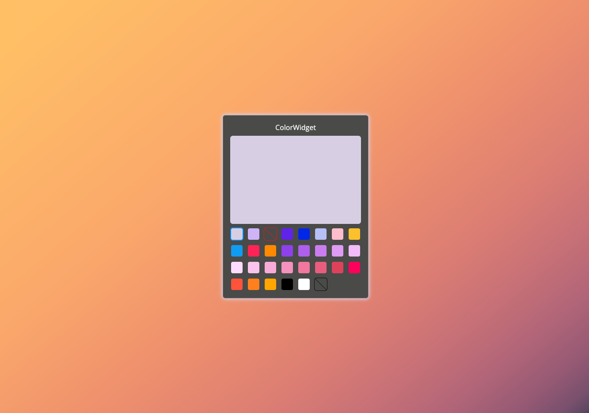

# Diversio FE take-home

This is Diversio's front-end take-home exercise.

## How to run

In the project directory, run:

```
yarn && yarn start
```

Runs the app in the development mode.\
Open [http://localhost:3000](http://localhost:3000) to view it in the browser.

To run the linter use:

```
yarn lint
```

**lint runs before committing any code thanks to pre-commit hooks with [husky](https://typicode.github.io/husky/#/)**



### TODO

> This are features that would be nice to add with more available time

#### As a user I want to be able to edit the `COLOR_LIST`

Add and edit ✏️ icon next to the title that will set the widget to an edit mode,
where all the listed color will have a red icon (top right) to delete the color from the list.

In the edit mode, the widget should have a way to add new colors, and option would be to add a
`ColorBox` like item, at the end or beginning of the list, with a plus icon that will trigger
a modal propting the new color (experiment with a preview) to add to the list.

There is no need to check if the color is valid or not, since the widget will render the `InvalidColorBox`
component

Store the user definded color in the local storage unless a backend ready

#### Copy and paste colors in different formats

As a use I want to be able to copy the color I've selected in any of this formats

`HEX`, `RGB`, `CMYK`, `HSV`, and `HSL`

> Use google [color picker](https://g.co/kgs/F5DTZp) as inspiration

All the options should have a copy icon that will copy the color value into the clipboard on user's click

This new feature should be under the `ColorWindow` privew box


#### Share colors with the world 🗺️

As a user I want to be able to share my colors to others in two ways, specific color I've 
added, and/or the entire config I have for my widget

Use query strings to share/load colors from the url, when the backend is ready we could 
generate a shorten link form the server
